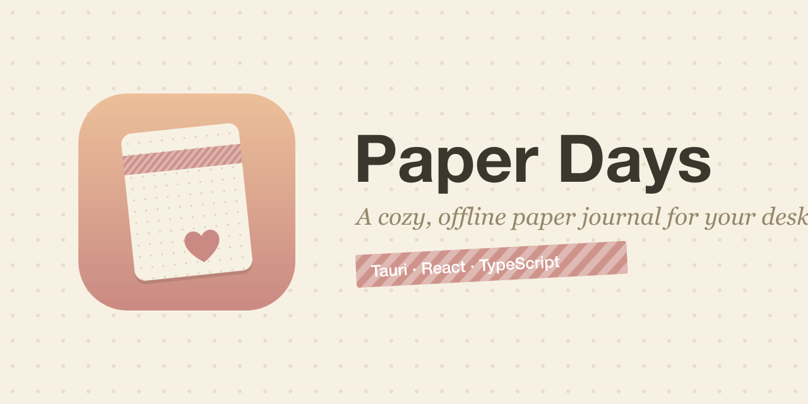

<p align="center">
  
</p>

# 📓 Paper Days

A warm, **Hobonichi-style journaling app** for your desktop. Quiet paper, your
stuff is the star. Everything lives as plain files in a folder on your computer —
**no cloud, no accounts, no server, no database.** Fully offline.

> Each day is a free canvas: add text, photos, video, stickers, and washi tape,
> then drag, resize, and rotate each piece freely — like sticking real things
> onto paper.

---

## ✨ Features

- **Month calendar** — a warm grid; days with entries show a marker or a little
  photo thumbnail; today is gently highlighted.
- **Daily canvas** — a faint dot-grid page where you place anything you like.
- **Place & arrange freely** — drag, resize, rotate, reorder, and delete every
  element (powered by react-moveable).
- **Your media, copied in** — import photos & video and they're copied into that
  day's own folder, so your journal is a self-contained bundle you can back up.
- **Stickers & washi tape** — a cozy starter library (hearts, stars, flowers,
  washi strips), plus import your own.
- **Handwriting font** — your notes are written in *Caveat*; UI stays a clean sans.
- **Light & night themes** — warm paper by day, soft dark paper by night.
- **Optional daily quote** — a quiet serif line at the bottom of each page.
- **Autosave** — there's no save button; changes write to disk automatically.

## 🗂️ How your data is stored

Everything is plain, human-readable files in one folder (default
`~/Documents/PaperDays/`) that you can open, read, and copy anywhere to back up:

```
PaperDays/
  settings.json              theme, fonts, journal path, quote on/off
  entries/
    2026/06/
      2026-06-14.json        the day's canvas: a list of elements
      2026-06-14/            media copied in for that day
        photo-1.jpg
        clip-1.mp4
  library/
    washi/                   washi textures (starter + your imports)
    stickers/                stickers (starter + your imports)
```

One JSON file per day describes the page as a list of `elements`
(`{ id, type, x, y, width, height, rotation, z, … }`). No database — just files.

## 🧰 Tech stack

- **[Tauri v2](https://tauri.app)** — a small, secure cross-platform desktop shell.
- **React + TypeScript**, built with **Vite**.
- **react-moveable** for drag / resize / rotate on the canvas.
- **@fontsource/caveat** for the bundled, offline handwriting font.

## 🚀 Run it yourself

**Prerequisites:** [Node.js](https://nodejs.org), and the
[Tauri prerequisites](https://tauri.app/start/prerequisites/) (Rust toolchain +
your OS build tools).

```bash
npm install        # install dependencies
npm run tauri dev  # run the app in development
```

## 📦 Build a real app

```bash
npm run tauri build
```

This produces an optimized, double-clickable app (a `.app` + `.dmg` on macOS)
in `src-tauri/target/release/bundle/`.

---

Built step by step as a first web/app project. 💛
